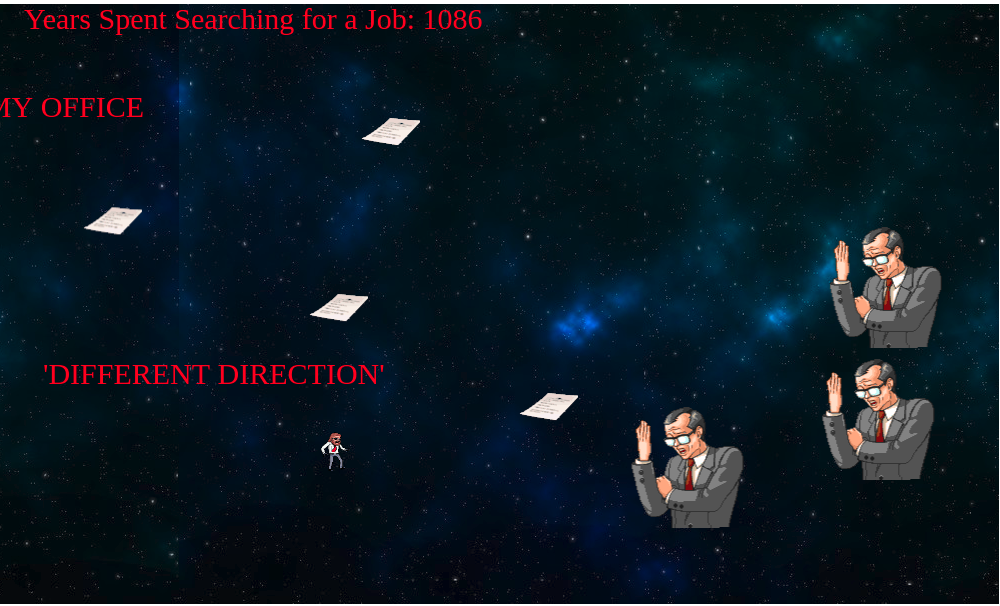

# Get a Job IN SPACE

  Do you want a job? How about a job in space? This endless runner utilizes jQuery, Canvas, HTML5, and JavaScript
  to create opportunities for you to avoid the pitfalls of the job hunt and if you are lucky enough get a job in space.


## WireFrames


## Architecture & Technologies

The game is divided into several classes for clean implementation via OOP practices. I utilized an object superclass and inheritance to create
obstacle, enemy, and character classes representing the objects in the game.  There is a background class which renders the infinitely
scrolling starscape, and a score and highscore class which implement scoring and the high score functionality.

```
class GameObject {
  constructor(x, y, ctx) {
    this.x = x;
    this.y = y;
    this.speed = 0;
    this.canvasHeight = 600;
    this.canvasWidth = 1000;
    this.context = ctx;
  }

  draw() {
  }
}

export default GameObject;
```

Objects are rendered onto the canvas via spritesheets, clipping the sheets at different coordinates to render animations for the objects in the game.

```
drawExplosion() {
  if (this.count === 0) {
    this.explodeNoise();
    this.count += 1;
  } else if (this.count < 30) {
    this.context.drawImage(this.explosionImage,0,0,65,65,this.x,this.y,65,65);
    this.count += 1;
  } else if (this.count < 60) {
    this.context.drawImage(this.explosionImage,0,65,65,65,this.x,this.y,65,65);
    this.count += 1;
  } else if (this.count < 90) {
    this.context.drawImage(this.explosionImage,0,130,65,65,this.x,this.y,65,65);
    this.count += 1;
  } else if (this.count < 120) {
    this.context.drawImage(this.explosionImage,0,195,65,65,this.x,this.y,65,65);
    this.count += 1;
  } else {
    return null;
  }
}
```

 Hit detection between these objects is implemented via a bounding box algorithm. Objects maintain references to their coordinates on the canvas in order to be drawable, so these coordinates are used to represent hitboxes. These hitboxes are checked for collision on a set interval as the game is animated using the requestAnimationFrame shim.

```
checkCollision(object) {
  const playerHitbox = this.hitbox();
  const objectHitbox = object.hitbox();
  {
    if (
      playerHitbox.x1 < objectHitbox.x2 &&
      playerHitbox.x2 > objectHitbox.x1 &&
      playerHitbox.y1 < objectHitbox.y2 &&
      playerHitbox.y2 > objectHitbox.y1
    ) {
      this.dead = true;
      return true;
    }
  }
}
```

Jquery is utilized by the high score class to check the current high score and allow the user to save their name to the illustrious list of
people who have jobs in space if they are diligent enough.


## Bonuses

[] Implement background music and explosion sound effect on player leaving labor participation pool.

[] Implement high score and ability to save high score so that the best jobseekers are stored serverside.

[] Have destroyable obstacles and an attack to do so with.

[] Gradually increasing speed of game as time goes on.
